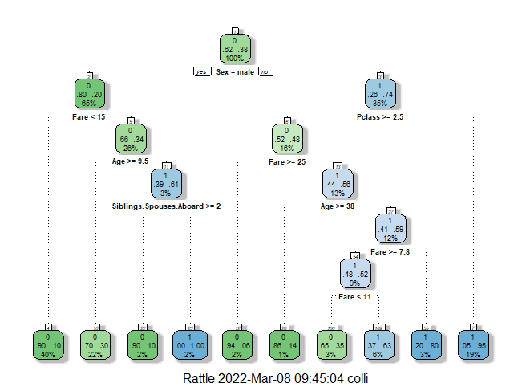

## A simple decision tree model

This is a simple script that uses the R programming language to build a decision tree model with the titanic dataset. If you want to try it yourself, I would suggest this "Getting Started with R" article- https://support.rstudio.com/hc/en-us/articles/201141096-Getting-Started-with-R

The output of the model will be this image of the tree plus the confusion matrix and other relevant statistics.

